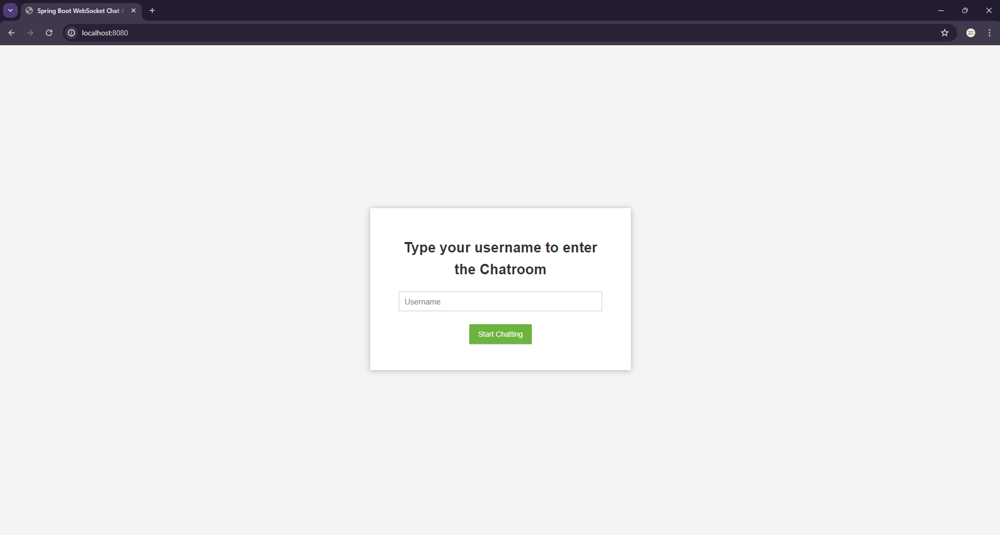
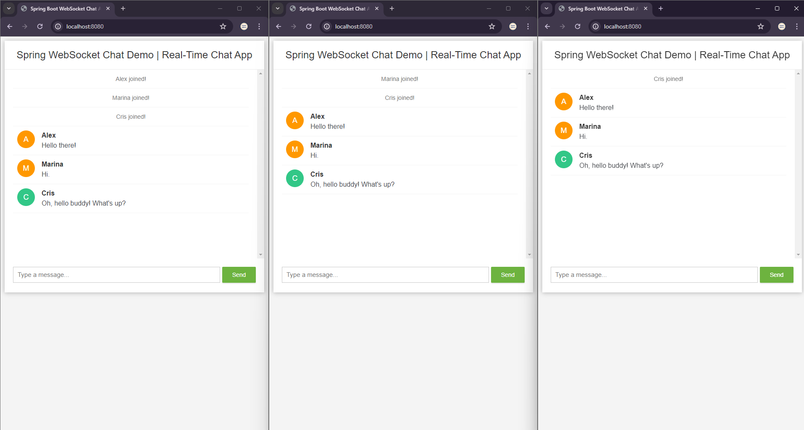
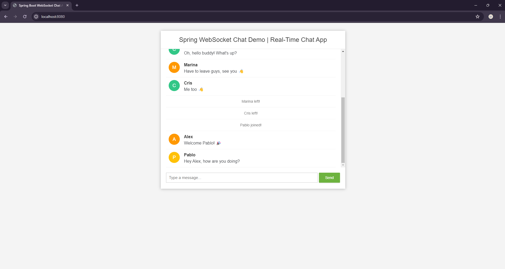

# Real-Time Chat App | Spring - WebSocket

---
## Tech Stack
### Backend 
- **Java** *(v21)*
- **Spring Boot** *(v3.2.5)*
  - **Spring Web**: to build web, including RESTful, apps using **Spring MVC**. Uses **Apache Tomcat** as the default embedded container. 
  - **WebSocket**: to build Servlet-based WebSocket app with **SockJS** and **STOMP**.
  - **Lombok**: Java annotation library which helps to reduce boilerplate code.
- **Maven**: build automation and project management tool
### Frontend
- **HTML**
- **CSS**
- **JavaScript**

---
## Shots In Action
### Landing Page

### Real-Time Chatting

### Users Entry / Exit The Chatroom 

---
## References
A huge shout-out to [Bouali Ali](https://youtube.com/@BoualiAli) for providing [this](https://youtu.be/TywlS9iAZCM) comprehensive and educative tutorial. 